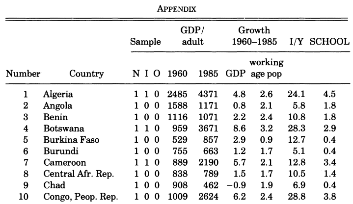

```{r setup, include = FALSE}

library(knitr)
library(rmdformats)
library(dplyr)
opts_chunk$set(echo=TRUE,
	             cache=FALSE,
               prompt=FALSE,
               tidy=FALSE,
               comment=NA,
               message=FALSE,
               warning=FALSE)


```


In this post I replicate the findings of Mankiw, Romer and Weil's 'A Contribution to the Empirics of Economic Growth'. This _should_ be a pretty simple task since the paper only uses 121 observations; has been replicated before by Bernanke and Giirkaynak and uses a straightforward econometric framework but I run into a few issues. Ultimately, I successfully replicate the authors' main findings but fail to satisfactorily replicate the authors' estimates of the Solow residual (i.e. we get different intercepts). The 'new' old data I collect is available on GitHub. 

## Data

MRW use data from the Real National Accounts collated by Summers and Heston - now known as the Penn World Table - as well as the World Bank's _World Tables_  and _World Development Report_ 1988.^[Ben S. Bernanke & Refet S. Gürkaynak, 2002. "Is Growth Exogenous? Taking Mankiw, Romer, and Weil Seriously," NBER Chapters,in: NBER Macroeconomics Annual 2001, Volume 16, pages 11-72 National Bureau of Economic Research, Inc.] Unfortunately, the PWT 4.0, which MRW use, is no longer available online (the earliest version available is 5.6 but this has revised figures) however the advantage of replicating a paper written in 1992 is that all the data can be found tabulated in the appendix:



Converting the data from an appendix pdf table into R requires the tabulizer library (and its dependency rJava):
```{r Loading_PDF}
library(tabulizer)
library(dplyr)


MRW_pdf <- extract_tables('assets/Original Data/MRW_appendix.pdf')

# Each list entry corresponds to a page of the appendix
df.1 <- MRW_pdf[[1]] %>% 
  as_tibble()

df.2 <- MRW_pdf[[2]] %>% 
  as_tibble()

df.3 <- MRW_pdf[[3]] %>% 
  as_tibble()
knitr::kable(head(df.1))
```

Unfortunately not everything is perfect: the variables are saved as strings, the column names appear as the first row and some values are in the columns they shouldn't be; here the OECD dummy and GDP in 1960 have both been stored in V5:

```{r, Display_Problems}
print(class(df.3$V6))
knitr::kable(df.3 %>% filter(V2 == 'United States'))

```

The column names are pretty easy to fix using a generic cleaning function and mapping the three appendix page dataframes into a single tibble: 
```{r Cleaning_Initial_Table}
library(purrr)

clean.table <- function(table, columns){
  table <- table[2:nrow(table), ]
  colnames(table) <- columns
  
  return(table)
}
cols <- c("number",
          "country",
          "N",
          "I",
          "O",
          "1960",
          "1985",
          "gdp_ch",
          "working_age_pop_ch",
          "s",
          "school")

MRW_data <- list(df.1, df.2, df.3) %>% 
  map_df(~clean.table(table = .x, columns = cols)) %>% 
  mutate(nchar_oecd = nchar(O))
```

The jumbled values are a bit harder to solve. Spotting that errors aren't random but only occur in observations with 5 digit (i.e. 10,000+) GDP figures speeds up the process - this is where `nchar_oecd` above comes in. We can use `separate` to split the OECD column whenever it encounters a space character.
```{r OECD_Fix}
library(tidyr)
MRW_data_ok_oecd <- MRW_data %>% 
  filter(nchar_oecd == 1) %>% 
  select(-nchar_oecd)


MRW_data_not_ok_oecd <- MRW_data %>% 
  filter(nchar_oecd > 1) %>% 
  separate(col = 'O', sep = ' ', into = c('O', '1960')) %>% 
  select(-nchar_oecd)

```

```{r hidden_clean, echo = FALSE}
MRW_clean <- bind_rows(MRW_data_not_ok_oecd,
                       MRW_data_ok_oecd) %>%
  mutate_at(c('N',
              'number',
              'I',
              'O',
              'gdp_ch',
              'working_age_pop_ch',
              's',
              'school'), as.numeric) %>% 
  mutate('1985' = as.numeric(gsub(',', '', `1985`)),
         '1960' = as.numeric(gsub(',', '', `1960`))) %>% 
  mutate(n_g_d = working_age_pop_ch + 5) 
```


 Next we convert the strings to numeric values whilst taking into account the presence of commas in the 1960 and 1985 GDP variables. Finally, we add 5 to the `working_age_pop_ch` variable - this corresponds to MRW using 0.05 as the value of depreciation and technology growth.^[Mankiw, Romer and Weil aren't entirely consistent in their treatment of percentages in the paper - the appendix shows that working age population change has mean value `r round(mean(MRW_clean$working_age_pop_ch, na.rm = TRUE), 2)` but the authors refer to $g + d = 0.05$ in the main body of the paper. Common sense and footnote 6 suggest that this means a 5% depreciation rate and the mean working age population should be treated as `r round(mean(MRW_clean$working_age_pop_ch, na.rm = TRUE), 2)`\% (and not 200\%...), I return to this later when the Solow residual fails to match.]
```{r MRW_clean, eval = FALSE}
MRW_clean <- bind_rows(MRW_data_not_ok_oecd,
                       MRW_data_ok_oecd) %>%
  mutate_at(c('N',
              'number',
              'I',
              'O',
              'gdp_ch',
              'working_age_pop_ch',
              's',
              'school'), as.numeric) %>% 
  mutate('1985' = as.numeric(gsub(',', '', `1985`)),
         '1960' = as.numeric(gsub(',', '', `1960`))) %>% 
  mutate(n_g_d = working_age_pop_ch + 5) 
```

The data has the right number of OECD, intermediate and non-oil countries and no particularly unusual observations suggesting anything has gone awry. I have checked every OECD datapoint against the original appendix and a (ad-hoc) random sample of non-OECD observations. (Missing values come from those missing in the original appendix.)
```{r Skim}
library(plotly)
library(ggplot2)

skimr::skim(MRW_clean) # skimr's histograms are known to be buggy in Rmd.

```

A few interactive plots using `plotly`:

```{r Plots}

MRW_clean_subset <- MRW_clean %>% 
  select(-O)
q <- ggplot(MRW_clean, aes(y = log(`1960`), x = school, text = country)) +
  geom_point(data = MRW_clean_subset, colour = 'grey', alpha = 0.2, fill = 'grey') +
  geom_point(data = MRW_clean, colour = 'deeppink') +
  facet_wrap(~O) +
  ylab('Log Real GDP pc in 1960') +
  ggtitle('Schooling vs GDP in OECD and non-OECD countries') +
  theme_minimal()

rm(MRW_clean_subset)
ggplotly(q)


p <- plot_ly(data = MRW_clean,
             x = ~s,
             y = ~`1985`,
             size = ~school,
             text = ~country,
             type = 'scatter',
             mode = 'markers'
             ) %>% 
  layout(yaxis = list(title = 'Log Real GDP pc in 1985'),
         xaxis = list(title = 'Savings rate (I/Y)'),
         title = 'GDP vs Savings rate \n size = schooling')
p
```

## Estimating the Solow Model and Augmented Solow Model

The regression equation Mankiw, Romer and Weil estimate can be written as $ln(GDP_i) = \alpha + ln(s_i) + ln(n_i+g_i+d_i) + e_i$ where GDP is actually GDP per working age person (although the appendix displays this as GDP/adult in the interests of brevity); $s_i$, the savings rate,  is calculated using investment as a share of GDP; $n_i$ is the average change in working age population between 1960 and 1985 and $g_i+d_i$ are assumed to sum to 0.05.

The augmented model is the same but we add in a `school` variable to control for human capital.


Formulating the above in R and splitting countries into subsets gives:

```{r Solow_model}
solow_formula <- log(`1985`) ~ log(s) + log(`n_g_d`)

## Non-Oil
non_oil_data <- MRW_clean %>% 
  filter(N == 1) %>% 
  filter(!is.na(school)) # MRW drop missing school observations to make comparisons easier

non_oil_model <- lm(solow_formula,
                    data = non_oil_data)

## Intermediate
intermediate_data <- MRW_clean %>% 
  filter(I == 1) %>% 
  filter(!is.na(school))

intermediate_model <- lm(solow_formula,
                         data = intermediate_data)

## OECD
oecd_data <- MRW_clean %>% 
  filter(O == 1) %>% 
  filter(!is.na(school))

oecd_model <- lm(solow_formula,
                 data = oecd_data)

#### Augmented Model
augmented_formula <- log(`1985`) ~ log(s) + log(n_g_d) + log(school)

## Non-Oil
aug_non_oil_model <- lm(augmented_formula,
                        data = non_oil_data)


## Intermediate
aug_intermediate_model <- lm(augmented_formula,
                             data = intermediate_data)


## OECD

aug_oecd_model <- lm(augmented_formula,
                     data = oecd_data)
```

Now collecting and comparing results using broom's `tidy`. We use `map2_dfr` because we want each observation to have a variable describing which model it came from and I haven't figured out a simpler way to do this:
```{r collecting, tidy = FALSE}
library(broom)
collect.results <- function(models, names){
  
  results <- map2_dfr(.x = models,
                      .y = names,
                      .f = function(x, y){tidy(x) %>% mutate(subset = y)}) %>% 
    as_tibble()
  return(results)
}

solow_rep <- collect.results(list(non_oil_model,
                                 intermediate_model,
                                 oecd_model),
                            list('Non-Oil',
                                 'Intermediate',
                                 'OECD'))

augmented_rep <- collect.results(list(aug_non_oil_model,
                                     aug_intermediate_model,
                                     aug_oecd_model),
                                list('Non-Oil',
                                     'Intermediate',
                                     'OECD'))

solow_MRW <- tribble(
  ~term, ~estimate, ~std.error, ~statistic, ~p.value, ~subset,
  '(Intercept)', 5.48, 1.59, NA, NA, 'Non-Oil',
  'log(s)', 1.42, 0.14, NA, NA, 'Non-Oil',
  'log(n_g_d)', -1.97, 0.56, NA, NA, 'Non-Oil',
  '(Intercept)', 5.36, 1.55, NA, NA, 'Intermediate',
  'log(s)', 1.31, 0.17, NA, NA, 'Intermediate',
  'log(n_g_d)', -2.01, 0.53, NA, NA, 'Intermediate',
  '(Intercept)', 7.97, 2.48, NA, NA, 'OECD',
  'log(s)', 0.5, 0.43, NA, NA, 'OECD',
  'log(n_g_d)', -0.76, 0.84, NA, NA, 'OECD'
)

augmented_MRW <- tribble(
  ~term, ~estimate, ~std.error, ~statistic, ~p.value, ~subset,
  '(Intercept)', 6.89, 1.17, NA, NA, 'Non-Oil',
   'log(s)',  0.69, 0.13, NA, NA, 'Non-Oil',
  'log(n_g_d)', -1.73, 0.41, NA, NA, 'Non-Oil',
  'log(school)', 0.66, 0.07, NA, NA, 'Non-Oil',
  '(Intercept)', 7.81, 1.19, NA, NA, 'Intermediate',
  'log(s)', 0.7, 0.15, NA, NA, 'Intermediate',
  'log(n_g_d)', -1.5, 0.4, NA, NA, 'Intermediate',
  'log(school)', 0.73, 0.1, NA, NA, 'Intermediate',
  '(Intercept)', 8.63, 2.19, NA, NA, 'OECD',
  'log(s)', 0.28, 0.39, NA, NA, 'OECD',
  'log(n_g_d)', -1.07, 0.75, NA, NA, 'OECD',
  'log(school)', 0.76, 0.29, NA, NA, 'OECD'
)

```
The MRW data comes from just manually transferring estimates and standard errors from Table 1 and Table 2 into a tibble using `tribble`.


## Comparing Results

We need to collect parameters from each of our models and compare between replicated and original estimates. This function selects the right parameter (and re-orders them for easier comparison); merges the two dataframe estimates into one and calculates the estimated differences. We use `grep` to find replicated and original columns and `pull` lets us access the values in each selected tibble (I'm not entirely sure why we can't subtract tibble A from tibble B here):
```{r compare function}

compare.results <- function(parameter, parameter_type = 'estimate', results_replicated, results_original){
  replicated_comparison <- results_replicated %>% 
    filter(term == parameter) %>% 
    select(term, subset, parameter_type)
  
  original_comparison <- results_original %>% 
    filter(term == parameter) %>% 
    select(term, subset, parameter_type)
  
  comparison_df <- full_join(x = replicated_comparison,
                             y = original_comparison,
                             by = c('term', 'subset'),
                             suffix = c('_replicated', '_original'))
  comparison_df$diff <- comparison_df[, grep('_original', colnames(comparison_df))] %>% 
    pull - comparison_df[, grep('_replicated', colnames(comparison_df))] %>% 
    pull
  comparison_df$rounded_diff <- round(comparison_df$diff, 2)
  comparison_df$pct_orig <- comparison_df$diff / comparison_df[, grep('_original', colnames(comparison_df))] %>% pull * 100
  return(comparison_df)
}


```
 We then use `map_df` to apply the function to each parameter type and collect our output in a dataframe:
```{r comparing}


parameters <- c('(Intercept)',
                'log(s)',
                'log(n_g_d)')

solow_comparison_estimates <- parameters %>% 
  map_df(compare.results,
         parameter_type = 'estimate',
         results_replicated = solow_rep,
         results_original = solow_MRW)

augmented_comparison_estimates <- parameters %>% 
  map_df(compare.results,
         parameter_type = 'estimate',
         results_replicated = augmented_rep,
         results_original = augmented_MRW)


solow_comparison_std_error <- parameters %>% 
  map_df(compare.results,
         parameter_type = 'std.error',
         results_replicated = solow_rep,
         results_original = solow_MRW)

augmented_comparison_std_error<- parameters %>% 
  map_df(compare.results,
         parameter_type = 'std.error',
         results_replicated = augmented_rep,
         results_original = augmented_MRW)

```

Looking at Table 1's replicated estimates is a mixed bag:

```{r table1_estimates, echo = FALSE}
kable(solow_comparison_estimates)
```

The variable estimates are on point but we're pretty off on the intercept. In fact, the same is true for both the standard errors and the augmented Solow model (which can also be found on GitHub.):

```{r}
all_estimates <- bind_rows(solow_comparison_estimates,
                         augmented_comparison_estimates)
all_std_errors <- bind_rows(solow_comparison_std_error,
                            augmented_comparison_std_error)

mean_est_diff <- all_estimates %>% 
  group_by(term) %>% 
  summarise(mean(diff),
            mean(pct_orig))
mean_est_diff

mean_std_diff <- all_std_errors %>% 
  group_by(term) %>% 
  summarise(mean(diff),
            mean(pct_orig))
mean_std_diff
```


## Conclusion


Our replicated intercepts are off on average by `r round(mean_est_diff[1,2],3)` in absolute terms or `r round(mean_est_diff[1,3], 1)`\%.^[This metric is a little tricky to interpret since we're using different models and three different subsets of countries.] 

Everything else, however, is pretty spot on. So, what's happening here?

The fact that the variable estimates are near perfect i.e. we're identifying the same slope as MRW but the wrong 'location' points to a couple of things. Since the intercept is off and there was a little confusion as to how add a constant to the model, recall MRW's +0.05 for depreciation and technology growth, it seems plausible at first glance that we've got the wrong scale when we added +5 to `working_age_pop_ch` and should have perhaps added 0.05. 

However, I don't think this holds up simply because whilst the behaviour exhibited perfectly matches the case of adding a constant to a regressor^[$y = \alpha + \beta(x+1)$ can be written as $y = \alpha + \beta + \beta x$ and identifies the 'same' $\beta$ but a different constant.] the relationship isn't linear but logarithmic and therefore not linearly separable^[$log(1 + x) \neq log(x) + 1$ although they're similar if $x$ is small which arguably it is here.]. Therefore I believe if this is the case our variable estimates should be off and whilst they're not absolutely perfect they're pretty close. 

This close but not perfect leads me to my second hypothesis - the data MRW use is subtly different to the data in their appendix. Namely, appendix data are all presented as either integers or to two decimal places but MRW probably used more precise data. This would explain why our variables, which are in logs, are close but not perfect. That is, they're less sensitive to small fluctuations in precision and our constant which is the only factor 'measured' in absolute terms is influenced more by these precision differences.

Finally, it's totally possible that I've completely misinterpreted part of the paper or mis-specified the models. I hope this isn't the case but the two ideas above look like a reasonable starting point to investigate further and will feature in my next post. The former will involve playing around with a lot of different transformations to $s$ and $n+g+d$ whilst the latter will look similar to wild block bootstrapping where the block is the data.

If you spot any mistakes or have any suggestions, please do get in touch.

