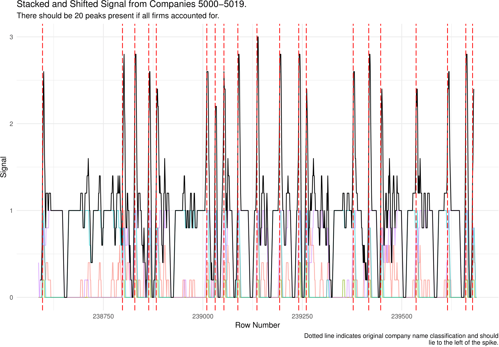

```{r setup, include=FALSE}
knitr::opts_chunk$set(echo = FALSE,
                      warning = FALSE,
                      message = FALSE,
                      cache = TRUE)
packages_vector <- c(
  "knitr",
  "dplyr",
  "readr",
  "ggplot2",
  "purrr",
  "tidyr",
  "stringr",
  "glue",
  "furrr",
  "zoo"
)
# Loading packages
lapply(packages_vector, require, character.only = TRUE)
# Loading functions
source("missing_companies_functions.R")
```

In this post we're going to look at a cool data cleaning solution I created to solve a problem we encountered whilst digitising Japanese archival data for Professor Dell. We have text data that has been output from a machine learning pipeline by some colleagues - we need to convert this text data into structured information about a company's name, address and profit values etc. whilst being robust to OCR errors and a variety of oopsies from the ML output.

The problem is occasionally we fail to identify the start of a company in the text data which means variables are assigned to the wrong company - we convert the issue into a known problem and use some time series/signal analysis tricks to improve on the ML output. 


## the cleaning pipeline

We have a data pipeline consisting of several steps:

- Scan images
- Segment into:
  - Pages
  - Columns
  - Rows
- __Classify rows__
- Optical Character Recognition
- Clean and reshape OCR output

Unfortunately, errors can occur in any one of these stages - our post today is tackling an issue arising in the row classification.


Each page we're digitising looks like so:

```{r pages_book}

```

I don't speak a word of Japanese which makes everything a little more exciting.

<!-- {width=600px} -->

Each page can be split into columns and corresponding rows - Jie Zhou created this breakdown:

```{r col_img}

```

<!-- {width=600px} -->


The output from the ML row classification looks like so:

```{r img_and_cls}

```


The classic case of a missing company is when the top row shown in the above image isn't recognised as a 2 (company) classification.
<!-- {width=400px} -->

## row classification

We classify rows into 6 categories:

- Page
- Blank
- __Company name__
- __Address__  
- __Variable name/Value__
- __Personnel__

We know that the basic structure of book __must__ follow the pattern above: __CAVP__.

There's a huge amount of information embedded in this structure that the ML model exploits too - Kaixuan Zhang has written a graphical model using this structure.

We're going to do the same thing but with a more traditional econometrics based approach.

## a problem

This is an example of a missing company:

```{r img_cls_missing}

```

<!-- {width=300px} -->


## initial solution

We were fixing this by using some simple heuristics that exploit the structure of the book. If Address comes after a Variable block it's reasonable to conclude that this is a misclassified Personnel block. Unfortunately these rules are quite strict/naive and can create more problems than solutions.

## new solution

The new method also exploits the repetitive structure of the problem but in a much more natural way. We need a way to spot a recurrent, noisey signal that's robust to noise.

This is a known problem!

## step 1: transform the data

Currently, the classification output is a _factor_ variable that takes values such as Address or Personnel.

We can transform this into 6 dummy/indicator variables - also called one-hot encoding in ML.

The dummy variable take a value equal to 1 if the current row corresponds to the dummy variable and 0 otherwise.


From this...
```{r long_data}
# Loading data
reclassified_cls_df <- read_csv("../assets/1954_cls.csv") %>% 
  rename(start_position = position) %>% # cleaning file positions
  path_to_id(variable = start_position,
             df = .) %>% 
  mutate(row = str_extract(start_position, "\\d+$")) %>% 
  mutate_at(vars(id_1, id_2, row), as.numeric)
# Finding where we have currently recorded firms starting in the book
approx_company_starts <- reclassified_cls_df %>%
  filter(ocls == 2) %>% # old cls
  group_by(company_no) %>% 
  summarise_all(first) %>% 
  mutate(company_start = TRUE)
# Joining cls dataframe with final dataframe so we know where final company positions are.
cls_original_id_df <- reclassified_cls_df %>% 
  mutate(company_start = ifelse(start_position %in% approx_company_starts$start_position, TRUE, FALSE),
         companyid = company_no) %>% 
  mutate(cls_name = case_when( # naming variables instead of using numeric naming convention
    ocls == 1 ~ "page",
    ocls == 2 ~ "company",
    ocls == 3 ~ "address",
    ocls == 4 | ocls == 5 ~ "variable",
    ocls == 6 ~ "personnel",
  )) %>% # combining v name and v value
  fill(companyid) %>%  
  rename(path = start_position)

cls_original_id_df %>% 
  select(row, cls_name) %>% 
  head() %>% 
  kable()
```

...into this:
```{r wide_data}
## Creating wide dataframe - need to do this for all DFs we wanna analyse using signal functions
cls_wide_df <- cls_original_id_df %>%
  model.matrix(~ 0 + cls_name, .) %>% 
  as_tibble() %>% 
  bind_cols(cls_original_id_df) %>% 
  mutate(total_row_id = row_number()) # BIG assumption - not missing any rows
cls_wide_df %>% 
  head() %>%
  select(total_row_id, starts_with("cls_name"), -cls_name) %>% 
  rename(address = cls_nameaddress,
         company = cls_namecompany,
         page = cls_namepage,
         personnel = cls_namepersonnel,
         variable = cls_namevariable) %>% 
  kable()


```


How does this help us?

Well, now we effectively have a timeseries of 5 variables. Where each observation (think time period) is a row in the book.

We can plot this:

```{r signal_binary_plot}
cls_df_filtered <- cls_wide_df %>%
  filter(companyid > 5, companyid < 10)

variable_plot <- cls_df_filtered %>%
  select_at(vars(starts_with("cls_"),cls_name, row, total_row_id)) %>%
  rename(address = cls_nameaddress,
         company = cls_namecompany,
         page = cls_namepage,
         personnel = cls_namepersonnel,
         variable = cls_namevariable) %>% 
  gather(variable, rolling_value, -cls_name, -row , -total_row_id) %>%
  filter(variable != "cls_namepage") %>%
  ggplot(aes(x = total_row_id, y = rolling_value, group = variable, colour = variable)) +
  geom_line() +
  facet_wrap(~variable, scales = "free") +
  guides(colour = "none") +
  labs(x = "Position in Book",
       y = "Signal",
       title = "Variable Signals for 5 Companies") +
  theme_minimal()
variable_plot
```

Next we apply a rolling mean to dampen down noise:
```{r, signal_rollmean_plot}
cls_rolling_df_filtered <-  cls_wide_df %>% 
  mutate_at(vars(starts_with("cls_"), -cls_name), ~rollapply(.,5,mean,align='right',fill=NA)) %>% 
  filter_at(vars(starts_with("cls_")), ~!is.na(.))


rolling_variable_plot <- cls_rolling_df_filtered %>%
  filter(companyid > 5, companyid < 10) %>% 
  select_at(vars(starts_with("cls_"),cls_name, row, total_row_id)) %>%
    rename(address = cls_nameaddress,
         company = cls_namecompany,
         page = cls_namepage,
         personnel = cls_namepersonnel,
         variable = cls_namevariable) %>% 
  gather(variable, rolling_value, -cls_name, -row , -total_row_id) %>%
  filter(variable != "cls_namepage") %>%
  ggplot(aes(x = total_row_id, y = rolling_value, group = variable, colour = variable)) +
  geom_line() +
  facet_wrap(~variable, scales = "free") +
  guides(colour = "none") +
  labs(x = "Position in Book",
       y = "Signal",
       title = "Variable Signals for 5 Companies",
       subtitle = "Rolling Mean applied") +
  theme_minimal()
rolling_variable_plot

```

## step 2: estimation

We have these pretty curves, but where do we go from there?

Figuring out where a company stops and another starts is something we can sort of eyeball.

If we plot the curves on one axis:

```{r, overlaid_signal_plot}
rolling_variables_overlaid_plot <- cls_rolling_df_filtered %>%
  filter(companyid > 5, companyid < 10) %>% 
  select_at(vars(starts_with("cls_"),cls_name, row, total_row_id)) %>%
  gather(variable, rolling_value, -cls_name, -row , -total_row_id) %>%
  filter(variable == "cls_nameaddress" | variable == "cls_namecompany" | variable == "cls_namepersonnel" | variable == "cls_namevname") %>%
  group_by(variable) %>%
  mutate(rolling_rescaled = scale(rolling_value)) %>%
  ggplot(aes(x = total_row_id, y = rolling_rescaled, colour = variable, group = variable)) +
  geom_line() +
  theme_minimal() +
  guides(colour = "none") +
  labs(title = "Variable Signals, overlaid")
rolling_variables_overlaid_plot
```


But we can't eyeball 10,000 plots...


## CCF

Figuring out where each company's signal ends is actually the same as figuring out the best way to 'stack' the curves.

We want to know by how much we should shift each curve to maximise their summed vertical distance - remember each curve is a different __variable__ (C, A, V or P).


## timeseries primer

When we estimate/analyse time series we typically use spectral density analysis - this sounds complicated but it's essentially just a transformation of a curve's autocorrelation function.

The autocorrelation function is just the correlation between $y_t$ and $y_{t-s}$ - the correlation between $y$ today and $y$ $s$ periods ago.

-We want the same thing but the _cross_ correlation between variables (the ACF might work but the CCF is probably more useful to us in this case.)


## estimating the CCF

Therefore, for each variable we estimate the cross-correlation function. This is just the ACF but instead of comparing $y_t$ and $y_{t-s}$ we want to compare $y_t$ and $x_{t-s}$. We use the __Company name__ as our "anchor variable" - we estimate the ACF for each variable against the Company name variable.

Then we lag each curve by whichever lag _maximises_ the absolute value of the CCF.

We could jointly estimate everything and take the max of some norm, or estimate the spectral density and use some more complex analysis but we don't really need to.
  
### CCF plot I

```{r ccf_plot1}
address_variable_acf <- ccf(cls_rolling_df_filtered$cls_nameaddress,
                            cls_rolling_df_filtered$cls_namevariable,
                            lag.max = 40)
```

### CCF plot II

```{r ccf_plot2}
address_personnel_acf <- ccf(cls_rolling_df_filtered$cls_nameaddress,
                             cls_rolling_df_filtered$cls_namepersonnel,
                             lag.max = 40)
```


## step 3: shift curves

Shifting the curves by their lag looks like this: 

```{r shifted_signal_plot}
best_lag_av <- address_variable_acf$lag[which.max(address_variable_acf$acf)]
best_lag_ap <- address_personnel_acf$lag[which.max(address_personnel_acf$acf)]

cls_lagged_rolling_df <- cls_rolling_df_filtered %>%
  filter(companyid > 5, companyid < 10) %>% 
  shift_curves(., cls_namepersonnel, best_lag_ap) %>%
  shift_curves(., cls_namevariable, best_lag_av)

# cls_lagged_rolling_df %>%
#   select_at(vars(cls_nameaddress,
#                  cls_namevariable_lag,
#                  cls_namepersonnel_lag,
#                  cls_name,
#                  row,
#                  total_row_id)) %>%
#     rename(address = cls_nameaddress,
#          personnel = cls_namepersonnel_lag,
#          variable = cls_namevariable_lag) %>% 
#   gather(variable, rolling_value, -cls_name, -row, -total_row_id) %>%
#   ggplot(aes(x = total_row_id,
#              y = rolling_value,
#              colour = variable)) +
#   geom_line() +
#   theme_minimal() +
#   theme(legend.position = "bottom") +
#   labs(title = "Shifted Signals",
#        subtitle = "4 companies present",
#        y = "Signal",
#        x = "Row Number") +
#   ylim(0, 3)
cls_lagged_sum_df <- cls_lagged_rolling_df %>%
  sum_curves(df = ., anchor_variable = cls_nameaddress)


cls_lagged_plot_df <- cls_lagged_sum_df %>%
  gather(variable, rolling_value, starts_with("cls_"), summed_curve, -cls_name)


overlaid_plot <- cls_lagged_plot_df %>%
  filter(variable != "summed_curve") %>%
  ggplot(aes(x = total_row_id, y = rolling_value, colour = variable)) +
  geom_line(alpha = 0.6) +
  theme_minimal() +
  geom_line(data = cls_lagged_plot_df %>% filter(variable == "summed_curve"), aes(x = total_row_id, y = rolling_value),
            colour = "NA") +
  theme(legend.position = "bottom") +
  labs(title = "Summed and Shifted Signals",
      subtitle = "4 companies present",
      y = "Signal",
      x = "Row Number") +
  guides(colour = "none") 
overlaid_plot

```

and stacking them creates a much more obvious plot we can check:

```{r stacked_signal_plot}

overlaid_plot <- cls_lagged_plot_df %>%
  filter(variable != "summed_curve") %>%
  ggplot(aes(x = total_row_id, y = rolling_value, colour = variable)) +
  geom_line(alpha = 0.6) +
  theme_minimal() +
  geom_line(data = cls_lagged_plot_df %>% filter(variable == "summed_curve"), aes(x = total_row_id, y = rolling_value),
            colour = "black") +
  theme(legend.position = "bottom") +
  labs(title = "Summed and Shifted Signals",
      subtitle = "4 companies present",
      y = "Signal",
      x = "Row Number") +
  guides(colour = "none") 

overlaid_plot
```


if we then overlay original classification:

```{r stacked_signal_overlaid}
overlaid_plot +
  geom_vline(data = cls_lagged_plot_df %>%
               filter(company_start == TRUE),
             aes(xintercept = total_row_id),
             linetype = "longdash",
             colour = "red") +
    labs(title = "Summed and Shifted Signals",
      subtitle = "4 companies present") 

```

we can see our time series method corresponds well with the original ML classification.

## visual analysis - good case
```{r no_miss_visual_plot}
run_graphical_signal_analysis(cls_rolling_df_filtered,
                              company_id_1 = 1000,
                              company_id_2 = 1004,
                              show_originals = TRUE,
                              anchor_variable = cls_namecompany,
                              signal_variables = c("cls_namepersonnel",
                                                   "cls_nameaddress",
                                                   "cls_namevariable",
                                                   "cls_namepage")) +
  theme(legend.position = "bottom") +
  guides(colour = "none") +
  labs(y = "Signal",
       x = "Row Number")

```


## visual analysis - bad case


Here we're missing the two companies in the middle:

```{r missing_firm_plot}
run_graphical_signal_analysis(cls_rolling_df_filtered,
                              company_id_1 = 853,
                              company_id_2 = 854,
                              show_originals = TRUE,
                              signal_variables = c("cls_namepersonnel",
                                                   "cls_nameaddress",
                                                   "cls_namevariable",
                                                   "cls_namepage")) +
  theme(legend.position = "bottom") +
    guides(colour = "none") +
  labs(y = "Signal",
       x = "Row Number")
```


We can run this for many firms/pages in the book and use multiple firms to estimate the appropriate ccf lags:


```{r auto_plot01}




```

```{r auto_plot19}
run_graphical_signal_analysis(df = cls_rolling_df_filtered,
                                company_id_1 = a,
                                company_id_2 = a + b,
                                show_originals = TRUE,
                                signal_variables = c("cls_namepersonnel",
                                                   "cls_nameaddress",
                                                   "cls_namevariable",
                                                   "cls_namepage")) +
    theme(legend.position = "bottom") +
    guides(colour = "none") +
  labs(y = "Signal",
       x = "Row Number")
b <- b + 1
```


```{r, eval = FALSE}

fluidRow(
  column(width = 4,numericInput("companyid", label = "Company to check:",
             min = 1, max = 9128, value = 5000)),
column(width = 4,numericInput("n_companies", label = "Companies per window",
             min = 2, max = 100, value = 2))
  
  
)

renderPlot({
  run_graphical_signal_analysis(df = cls_rolling_df_filtered,
                                company_id_1 = input$companyid,
                                company_id_2 = input$companyid + input$n_companies - 1,
                                show_originals = TRUE,
                                signal_variables = c("cls_namepersonnel",
                                                   "cls_nameaddress",
                                                   "cls_namevariable",
                                                   "cls_namepage")) +
    theme(legend.position = "bottom")
})
```


## automating visual analysis

We automated the visual analysis using a simple heuristic and ran the model across a range of hyper parameters.

This gives us the following plot of likely missing companies:

```{r running_median_detected_outlier_plot}


```

which is a pretty cool way to solve the problem - or at least I think it's cool.

## conclusion/why does this work?

We've developed a method that's doubly robust to noise. We use information from multiple _variables_ and multiple _firms_ per window to estimate the appropriate lag and transform the signal and finally, we're using a statistical model that can distinguish between trends and noise unlike the hueristic algorithm. 
